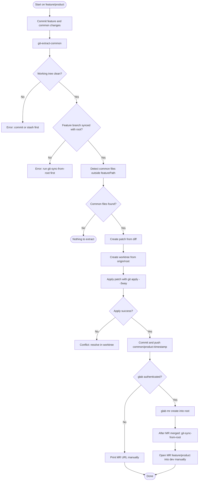
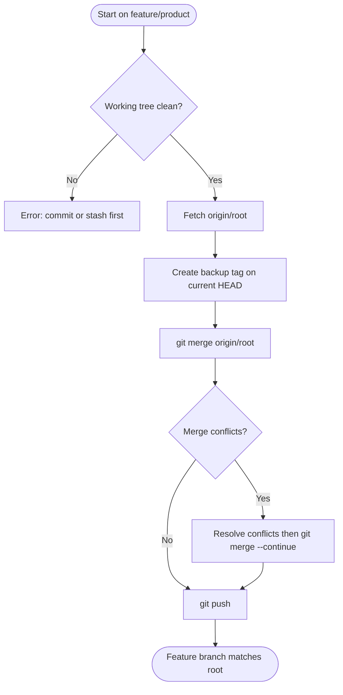
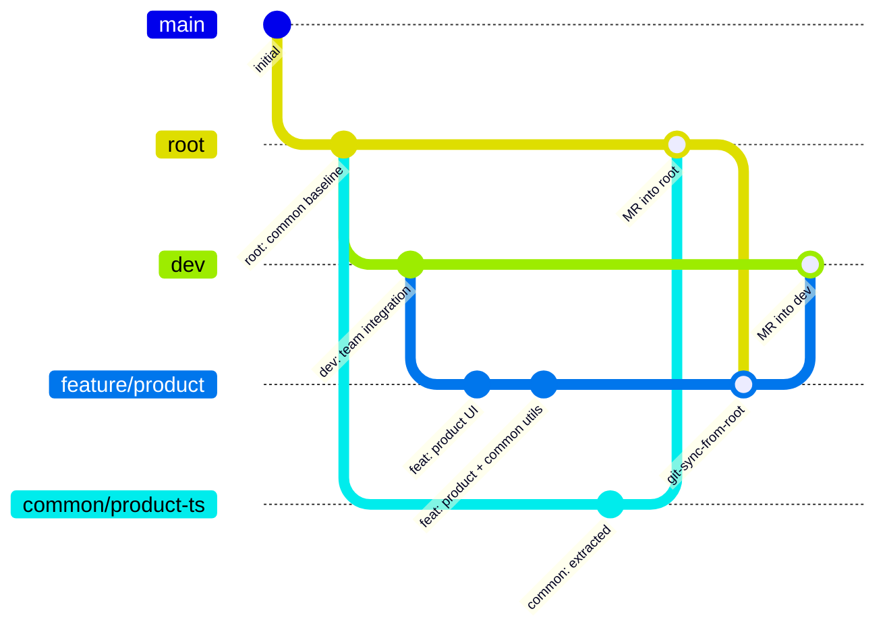

# @coolkits/git-workflows

[](https://www.npmjs.com/package/@coolkits/git-workflows)
[](https://www.npmjs.com/package/@coolkits/git-workflows)
[](https://nodejs.org)
[](./LICENSE)

Zero-dependency CLI toolkit for the **feature-based branch workflow**.

## Installation

### Per-project dev dependency (recommended)

```bash
npm install --save-dev @coolkits/git-workflows
# or
yarn add --dev @coolkits/git-workflows
```

Then add shortcuts to your `package.json`:

```json
{
  "scripts": {
    "git:extract-common": "git-extract-common",
    "git:sync-from-root": "git-sync-from-root"
  }
}
```

It automates two operations that are otherwise tedious and error-prone:

| Command              | What it does                                                                      |
| -------------------- | --------------------------------------------------------------------------------- |
| `git-extract-common` | Isolates shared code changes from a feature branch, opens an MR into **`root`**.  |
| `git-sync-from-root` | Merges **`root`** into the current feature branch (creates a rollback tag first). |

---

## Why use this?

When a repository organises code by **feature**, there is usually a rule like:

> Everything outside `src/features/**` is shared (common) code and must reach **`root`**
> through a dedicated merge request.

Developers often need to change both feature-specific and shared code in the same
branch. Splitting that into two separate merge requests by hand is slow:

- Easy to miss files.
- Easy to commit the wrong diff into the common branch.
- Hard to get the base commit right.

`@coolkits/git-workflows` removes all of that ceremony with a single command.

---

## Branch strategy

This toolkit assumes three branch roles in your repository:

| Branch          | Role                                                           | Who merges here                                           |
| --------------- | -------------------------------------------------------------- | --------------------------------------------------------- |
| **`root`**      | Common / shared source code (everything outside `featurePath`) | `git-extract-common` → MR into `root`                     |
| **`dev`**       | Team dev integration — used to build and test the full app     | Feature branch → MR into `dev` (manual, for dev builds)   |
| **`feature/*`** | Feature development (e.g. `feature/product`)                   | You work here; sync from `root` after common MR is merged |

```text
feature/product
  │
  ├── common changes ──► git-extract-common ──► MR ──► root
  │
  ├── after root MR merged ──► git-sync-from-root ──► feature/product updated
  │
  └── feature ready for dev build ──► MR (manual) ──► dev
```

- **`root`** holds the canonical common codebase. Feature branches must be synced with `root` before extracting.
- **`dev`** is where the team integrates features for dev environment builds. This CLI does **not** open MRs into `dev` — you do that manually when the feature is ready.
- **`main`** is not part of this workflow unless you configure it separately.

### Global (run from any repository)

```bash
npm install -g @coolkits/git-workflows
```

### No install (npx)

```bash
npx @coolkits/git-workflows git-extract-common --dry-run
```

---

## Configuration

> **TL;DR** — `git-controls.config.json` is to `@coolkits/git-workflows` what
> `.eslintrc.json` is to ESLint, or `prettier.config.js` is to Prettier.
> It tells the tool how _your_ project is structured.

When the tool runs, it searches for a config file in your project root and merges
your settings over the built-in defaults. If no file is found, the defaults apply.

### Config discovery order

The tool searches for these files in order (first match wins):

```
git-controls.config.js
git-controls.config.mjs
git-controls.config.json     ← simplest, recommended
.git-controlsrc.json
```

### Create your config

Copy the example file into your project root:

```bash
cp node_modules/@coolkits/git-workflows/git-controls.config.example.json git-controls.config.json
```

Then edit the values that differ from the defaults:

```json
{
  "rootBranch": "root",
  "devBranch": "dev",
  "remote": "origin",
  "featurePath": ["src/features"],
  "commonExcludePaths": ["service-worker-api", "packages/git-workflows"],
  "commonExcludeFiles": ["public/version.json", "public/mockServiceWorker.js"],
  "commonBranchPrefix": "common",
  "protectedBranches": ["root", "dev", "main", "master", "develop"],
  "mergeRequestProvider": "gitlab",
  "syncStrategy": "merge"
}
```

### Config options

| Key                    | Type                    | Default                                    | Description                                                                                                                 |
| ---------------------- | ----------------------- | ------------------------------------------ | --------------------------------------------------------------------------------------------------------------------------- |
| `rootBranch`           | `string`                | `"root"`                                   | Common-source branch. Extract MRs target this branch; sync merges this branch into the feature branch.                      |
| `devBranch`            | `string`                | `"dev"`                                    | Team dev integration branch. Documented for your workflow — feature MRs into `dev` are manual.                              |
| `remote`               | `string`                | `"origin"`                                 | Git remote name.                                                                                                            |
| `featurePath`          | `string \| string[]`    | `"src/features"`                           | Everything **outside** these paths is treated as shared code. Accepts a single string or an array.                          |
| `commonExcludePaths`   | `string \| string[]`    | `[]`                                       | **Directories** skipped during common extract (dir + all nested files). Submodule / tooling folders.                        |
| `commonExcludeFiles`   | `string \| string[]`    | `[]`                                       | **Individual files** skipped during common extract (exact path only — not siblings or parent dir).                          |
| `commonBranchPrefix`   | `string`                | `"common"`                                 | Prefix for generated common branch names: `common/<feature-branch-slug>-<ts>` (e.g. `common/feature-example-202605260220`). |
| `protectedBranches`    | `string[]`              | `["root","dev","main","master","develop"]` | Branches the CLI will refuse to operate on.                                                                                 |
| `mergeRequestProvider` | `"gitlab"` \| `"none"`  | `"gitlab"`                                 | Use `glab` CLI when available; `"none"` to always print a URL.                                                              |
| `syncStrategy`         | `"merge"` \| `"rebase"` | `"merge"`                                  | Strategy used when syncing the feature branch with `root`.                                                                  |

#### Excluding paths from common extract

By default, `git-extract-common` treats **everything outside `featurePath`** as common
code. Two optional lists narrow that scope further:

| Key                  | Use for                        | Git pathspec effect                                  | Example                                               |
| -------------------- | ------------------------------ | ---------------------------------------------------- | ----------------------------------------------------- |
| `commonExcludePaths` | Whole directories / submodules | Excludes the dir **and** all files beneath it        | `"service-worker-api"`, `"packages/git-workflows"`    |
| `commonExcludeFiles` | Single generated / local files | Excludes **one exact file** — siblings stay in scope | `"public/version.json"`, `"git-controls.config.json"` |

```json
{
  "featurePath": ["src/features"],
  "commonExcludePaths": ["service-worker-api", "packages/git-workflows"],
  "commonExcludeFiles": ["public/version.json", "public/mockServiceWorker.js"]
}
```

### Config as a JS file

For dynamic values (e.g. reading from environment variables):

```js
// git-controls.config.js
export default {
  rootBranch: 'root',
  devBranch: 'dev',
  featurePath: ['src/features', 'src/apps'],
};
```

---

## Connect to GitLab (enable auto MR creation)

When `glab` is installed **and** authenticated, `git-extract-common` automatically
creates a merge request into **`root`** after pushing the common branch — no
browser needed.

### Step 1 — Install glab

```bash
# macOS
brew install glab

# Windows (winget)
winget install --id GLab.GLab -e --source winget

# Windows (scoop)
scoop install glab

# Linux (snap)
sudo snap install glab
```

> Full list: [gitlab.com/gitlab-org/cli#installation](https://gitlab.com/gitlab-org/cli#installation)

### Step 2 — Authenticate

```bash
glab auth login --hostname your-gitlab-host.com
```

Follow the prompts. For self-hosted GitLab, replace `your-gitlab-host.com`
with your actual host (e.g. `gitlab.company.com`).

Verify the login:

```bash
glab auth status
```

### What happens when glab is not available

| Condition                              | Behavior                                                 |
| -------------------------------------- | -------------------------------------------------------- |
| `glab` not installed                   | Prints a browser-ready URL to create the MR manually.    |
| `glab` installed but not authenticated | Prints the URL and reminds you to run `glab auth login`. |
| `glab` authenticated                   | Creates the MR automatically. ✓                          |

---

## Usage

### Extract common changes

```bash
# Auto-detect the current branch and extract
git-extract-common

# Specify a branch explicitly
git-extract-common --branch feature/product

# Preview files that would be extracted (nothing is created)
git-extract-common --dry-run

# Push the common branch but skip merge request creation
git-extract-common --no-mr

# Enable verbose output
git-extract-common --debug

git-extract-common --help
```

### Sync `root` into feature branch

```bash
git-sync-from-root

git-sync-from-root --branch feature/product
git-sync-from-root --no-push
git-sync-from-root --debug
git-sync-from-root --help
```

Via `package.json` scripts:

```bash
yarn git:extract-common --dry-run
yarn git:sync-from-root
```

---

## Workflow

### Full cycle



### Sync from root



### Branch topology



---

## How `git-extract-common` works

```
1. Validate working tree is clean (no uncommitted tracked changes).
2. Resolve the feature branch (current branch or --branch value).
3. Fetch origin/root. Refuse if the feature branch is behind root.
4. Compute diff between merge-base(root, HEAD) and HEAD, excluding:
   - everything under `featurePath` (feature-specific code),
   - directories listed in `commonExcludePaths`,
   - individual files listed in `commonExcludeFiles`.
5. Write the diff to a temporary patch file.
6. Create a git worktree from origin/root on a new branch:
       common/<feature-branch-slug>-<YYYYMMDDHHmm>
7. Apply the patch (git apply --3way).
8. Commit, push, and open a merge request via glab (or print a URL).
```

```
feature/product (your branch)
  │
  ├── src/features/product/      ← STAYS in feature branch
  │
  ├── src/shared/product-api/   ─┐
  ├── src/utils/format.ts        ├── EXTRACTED → common/feature-product-20260525-0900
  └── src/i18n/vi/product.json  ─┘              MR → root (not dev)
```

When the feature is ready for a dev build, open a **separate MR** from `feature/product` → **`dev`** manually.

---

## How `git-sync-from-root` works

```
1. Validate working tree is clean.
2. Fetch origin/root.
3. Print incoming commits (what will be merged).
4. Create a backup tag on the current HEAD (see below).
5. git merge --no-edit origin/root
6. Push (unless --no-push).
```

### Why create a backup tag?

Before merging `root` into your feature branch, the tool creates a local tag such as:

```text
backup/feature-product-20260525103000
```

This tag points to the **exact commit you were on before the merge** — nothing is copied, it is just a bookmark.

| Without backup tag                            | With backup tag                                             |
| --------------------------------------------- | ----------------------------------------------------------- |
| Merge goes wrong → hunt through `git reflog`  | One command: `git reset --hard backup/feature-product-...`  |
| Conflict resolution gets messy → hard to undo | `git merge --abort` or reset to tag                         |
| Already pushed a bad merge → risky to fix     | Reset locally, then `git push --force-with-lease` if needed |

It is a **safety net**, not a required Git step. After you confirm the sync is correct, delete the tag:

```bash
git tag -d backup/feature-product-20260525103000
```

---

## Programmatic API

The package is also usable as a Node.js library:

```js
import {
  loadConfig,
  createLogger,
  runExtractCommonWorkflow,
  runSyncFromRootWorkflow,
} from '@coolkits/git-workflows';

const config = await loadConfig({ cwd: '/path/to/project' });
const logger = createLogger({ debug: true });

const result = await runExtractCommonWorkflow({
  config,
  logger,
  options: { dryRun: true },
});

console.log(result); // { status: 'extracted', commonBranch: '...', files: [...] }
```

### Available exports

| Export                       | Description                           |
| ---------------------------- | ------------------------------------- |
| `runExtractCommonWorkflow`   | Extract workflow (main operation)     |
| `runSyncFromRootWorkflow`    | Sync workflow (main operation)        |
| `loadConfig`                 | Load + merge config from project root |
| `DEFAULT_CONFIG`             | Built-in config object (frozen)       |
| `createLogger`               | Colored, leveled console logger       |
| `parseCliArgs`               | POSIX-style flag parser               |
| `createGitClient`            | Spawn-based git CLI wrapper           |
| `createBranchResolver`       | Branch resolution + checkout helpers  |
| `createWorkingTreeInspector` | Clean check / dirty file inspector    |
| `createGitLabProvider`       | MR creation via `glab` CLI            |
| `buildCommonPathspec`        | Build git pathspec for extract scope  |
| `directoryExcludePathspec`   | Pathspec entries for one directory    |
| `fileExcludePathspec`        | Pathspec entry for one file           |

---

## Conflict handling

| Scenario                             | Behavior                                                                  |
| ------------------------------------ | ------------------------------------------------------------------------- |
| Working tree has uncommitted changes | Lists the files and exits with code 1.                                    |
| Feature branch is behind root        | Refuses to extract. Prints manual sync commands.                          |
| Patch apply conflict                 | Stops. Leaves the worktree on disk. Prints step-by-step resolution guide. |
| Sync merge conflict                  | Stops. Backup tag available for rollback.                                 |

---

## Rollback

**Extract went wrong (MR not merged yet)**:

```bash
git push origin --delete common/<branch-name>
```

**Sync went wrong**:

```bash
git reset --hard backup/<branch>-<timestamp>
git push --force-with-lease   # only if already pushed
```

---

## Package structure

```
@coolkits/git-workflows/
├── bin/
│   ├── extract-common.js          # CLI entry point
│   └── sync-from-root.js          # CLI entry point
├── src/
│   ├── index.js                   # Public API
│   ├── config/
│   │   ├── default-config.js      # Built-in defaults (frozen Object)
│   │   └── load-config.js         # Project config loader
│   ├── core/
│   │   ├── git-client.js          # Thin git CLI wrapper
│   │   ├── branch-resolver.js     # resolve / ensure / checkout
│   │   └── working-tree.js        # Clean-state inspector
│   ├── providers/
│   │   └── gitlab-provider.js     # glab + fallback URL
│   ├── utils/
│   │   ├── logger.js              # Colored console output
│   │   ├── cli-args.js            # POSIX-style flag parser
│   │   └── temp-workspace.js      # Temp dir + safe cleanup
│   └── workflows/
│       ├── extract-common.js      # Orchestration
│       └── sync-from-root.js      # Orchestration
├── git-controls.config.example.json
├── CHANGELOG.md
├── CONTRIBUTING.md
├── LICENSE
└── README.md
```

---

## Requirements

- **Node.js >= 18.0.0**
- **git** on `PATH`
- **glab** CLI (optional) — for automatic merge request creation on GitLab

---

## Contributing

See [CONTRIBUTING.md](./CONTRIBUTING.md).

---

## License

[MIT](./LICENSE) © [David Ngo](https://github.com/davidngo239)
