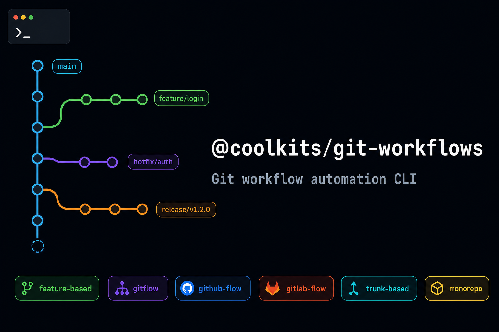

<div align="center">



[](https://www.npmjs.com/package/@coolkits/git-workflows)
[](https://www.npmjs.com/package/@coolkits/git-workflows)
[](https://nodejs.org)
[](./LICENSE)
[](https://github.com/coolkits-teams/coolkits-git-workflows)

**Git workflow automation CLI for modern development teams.**  
One command for every painful git situation - from daily flow automation to emergency rescues.

</div>

---

## 📦 Installation

```bash
npm install --save-dev @coolkits/git-workflows
# or
yarn add -D @coolkits/git-workflows
# or
pnpm add -D @coolkits/git-workflows
```

After install, the `coolkit` command is available globally in your project:

```bash
coolkit --help
coolkit undo --count 2
coolkit create-mr --target dev
```

### Optional: add shortcuts to `package.json`

```jsonc
{
  "scripts": {
    // ── Architecture workflows ──
    "extract-common": "coolkit extract-common", // Extract shared code → common branch → MR to root
    "sync-from-root": "coolkit sync-from-root", // Sync root changes into current feature branch
    "create-mr": "coolkit create-mr", // Create MR/PR between any two branches
    "start-branch": "coolkit start-branch", // Create feature / release / hotfix branch
    "finish-branch": "coolkit finish-branch", // Push branch and open MR(s) per architecture

    // ── Undo & fix commits ──
    "undo": "coolkit undo", // Undo unpushed commits (keeps changes staged)
    "revert-commit": "coolkit revert-commit", // Safely revert a pushed commit (no rewrite)
    "amend": "coolkit amend", // Fix last commit: message, add/remove files
    "squash": "coolkit squash", // Squash last N commits into one

    // ── Move & copy commits ──
    "move-commits": "coolkit move-commits", // Move commits to the correct branch
    "cherry-pick": "coolkit cherry-pick", // Cherry-pick one commit or a range

    // ── Branch management ──
    "delete-branch": "coolkit delete-branch", // Delete branch local + remote at once
    "recover-branch": "coolkit recover-branch", // Recover accidentally deleted branch (reflog)
    "prune-branches": "coolkit prune-branches", // Remove stale local branches (remote gone)

    // ── Conflict & sync ──
    "abort": "coolkit abort", // Abort stuck merge / rebase / cherry-pick
    "resolve": "coolkit resolve", // Resolve conflicts: accept all theirs or ours
    "pull-rebase": "coolkit pull-rebase", // Pull with rebase instead of merge

    // ── History & investigation ──
    "purge-file": "coolkit purge-file", // Remove sensitive file from entire git history
    "search-commits": "coolkit search-commits", // Find commits by message or code content
    "bisect": "coolkit bisect", // Binary search for bug-introducing commit

    // ── Tags ──
    "tag-create": "coolkit tag-create", // Create annotated tag and push to origin
    "tag-delete": "coolkit tag-delete" // Delete tag local + remote at once
  }
}
```

Then run `yarn extract-common` or `npm run extract-common`.

### Config (optional)

```bash
cp node_modules/@coolkits/git-workflows/git-controls.config.example.json git-controls.config.json
```

---

## ✨ What it does

`@coolkits/git-workflows` gives your team **two layers of commands**:

| Layer                         | Purpose                                                                                                                       |
| ----------------------------- | ----------------------------------------------------------------------------------------------------------------------------- |
| 🏗️ **Architecture workflows** | Automate branch strategies - `feature-based`, `gitflow`, `github-flow`, `gitlab-flow`, `trunk-based`, `monorepo`              |
| 🛠️ **Git utilities**          | One-liner commands for everyday pain points: undo, squash, amend, cherry-pick, branch recovery, conflict resolution, and more |

---

## 🏗️ Architecture Workflows

Select your workflow with `"architecture"` in `git-controls.config.json`.

### `feature-based` (default)

Separates common/shared code changes from feature changes across branches.

```bash
coolkit extract-common        # Extract shared changes → common/* branch → MR to root
coolkit sync-from-root        # Pull root changes into your feature branch
coolkit create-mr             # Open MR: feature → dev (for CI build)
coolkit start-branch user-auth        # Create feature/user-auth from dev
coolkit finish-branch                 # Push + MR → dev
```

### `gitflow`

Classic gitflow with `develop`, `release/*`, `hotfix/*`.

```bash
coolkit start-branch user-auth --type feature    # feature/user-auth from develop
coolkit start-branch 1.2.0 --type release        # release/1.2.0 from develop
coolkit start-branch urgent-fix --type hotfix    # hotfix/urgent-fix from main
coolkit finish-branch                            # MR → develop (feature) / main (release/hotfix)
```

### Other architectures

| Preset        | Default target for MR | Typical flow                           |
| ------------- | --------------------- | -------------------------------------- |
| `github-flow` | `main`                | feature → PR → main                    |
| `gitlab-flow` | `main` → env branches | feature → main → staging → production  |
| `trunk-based` | `main`                | short-lived feature → quick MR to main |
| `monorepo`    | `main`                | scoped `feature/pkg-name` → main       |

### `create-mr` - Universal MR creator

```bash
coolkit create-mr                                  # current branch → default target
coolkit create-mr --target main --checkout         # safe MR branch (keeps source clean)
coolkit create-mr --target staging --checkout --base target  # surface conflicts locally
coolkit create-mr --source feature/auth --target develop
coolkit create-mr --dry-run
```

| Flag                    | Description                                                           |
| ----------------------- | --------------------------------------------------------------------- |
| `--source`              | Source branch (default: current)                                      |
| `--target`              | Target branch (default: architecture-aware)                           |
| `--checkout`            | Create a `mr/<slug>-<ts>` branch - keeps your feature branch pristine |
| `--base source\|target` | What the MR branch is based on (default: `source`)                    |
| `--no-push`             | Skip push, just open the MR URL                                       |
| `--dry-run`             | Preview without creating anything                                     |

---

## 🛠️ Git Utilities

Commands for everyday pain points. All work independently of architecture.

### Undo & Revert

| Command                        | What it does                                                       |
| ------------------------------ | ------------------------------------------------------------------ |
| `coolkit undo`                 | Undo last N **unpushed** commits (keeps changes staged by default) |
| `coolkit undo --hard`          | Undo last N commits AND discard all changes                        |
| `coolkit revert-commit <hash>` | Safely revert a **pushed** commit (creates a new revert commit)    |

```bash
coolkit undo --count 2           # undo 2 commits, keep changes
coolkit revert-commit abc1234    # safe for shared branches
```

### Fix Last Commit

| Command                               | What it does                        |
| ------------------------------------- | ----------------------------------- |
| `coolkit amend --message "fix: typo"` | Change last commit message          |
| `coolkit amend --add src/file.ts`     | Add a forgotten file to last commit |
| `coolkit amend --remove .env`         | Remove a file from last commit      |
| `coolkit amend --force`               | Amend + force-push (warns team)     |
| `coolkit squash --count 3`            | Squash last 3 commits into one      |

### Move & Copy Commits

| Command                                            | What it does                                |
| -------------------------------------------------- | ------------------------------------------- |
| `coolkit move-commits --to feature/correct-branch` | Move last N commits to the right branch     |
| `coolkit cherry-pick abc1234`                      | Apply a specific commit from another branch |
| `coolkit cherry-pick abc1234 --range-to def5678`   | Apply a range of commits                    |

```bash
coolkit move-commits --to feature/auth --count 3   # "I committed to main by mistake"
coolkit cherry-pick abc1234 --no-commit             # apply but don't commit yet
```

### Branch Management

| Command                                  | What it does                                    |
| ---------------------------------------- | ----------------------------------------------- |
| `coolkit delete-branch feature/done`     | Delete branch **local + remote** in one command |
| `coolkit recover-branch feature/deleted` | Recover a recently deleted branch from reflog   |
| `coolkit prune-branches`                 | Remove all local branches whose remote is gone  |
| `coolkit prune-branches --dry-run`       | Preview what would be deleted                   |

### Conflict Resolution

| Command                    | What it does                                          |
| -------------------------- | ----------------------------------------------------- |
| `coolkit abort`            | Auto-detect and abort stuck merge/rebase/cherry-pick  |
| `coolkit resolve --theirs` | Resolve all conflicts by accepting incoming changes   |
| `coolkit resolve --ours`   | Resolve all conflicts by keeping local changes        |
| `coolkit pull-rebase`      | `git pull --rebase` - no merge commit, linear history |

### History & Investigation

| Command                                      | What it does                                   |
| -------------------------------------------- | ---------------------------------------------- |
| `coolkit search-commits --message "feat:"`   | Search commits by message                      |
| `coolkit search-commits --content "API_KEY"` | Search commits that changed a string           |
| `coolkit bisect start --good <hash>`         | Start binary search for bug-introducing commit |
| `coolkit bisect good\|bad`                   | Mark current commit during bisect              |
| `coolkit bisect reset`                       | Abort bisect and return to your branch         |

### Sensitive File Removal

```bash
# Always preview first!
coolkit purge-file .env --dry-run
coolkit purge-file .env

# After running, force-push all branches + notify team to re-clone
git push origin --force --all
```

> ⚠️ This rewrites ALL git history. If a secret was exposed, **rotate it immediately** regardless.

### Tags

| Command                                        | What it does                          |
| ---------------------------------------------- | ------------------------------------- |
| `coolkit tag-create v1.2.0`                    | Create annotated tag + push to remote |
| `coolkit tag-create v1.2.0 --message "Stable"` | Tag with custom message               |
| `coolkit tag-delete v1.2.0`                    | Delete tag **local + remote**         |

---

## ⚙️ Configuration

Create `git-controls.config.json` in your project root:

```json
{
  "architecture": "feature-based",
  "rootBranch": "root",
  "devBranch": "dev",
  "remote": "origin",
  "featurePath": ["src/features"],
  "mergeRequestProvider": "gitlab"
}
```

Config files per architecture: [`config-examples/`](./config-examples/)

| Field                  | Default         | Description                                               |
| ---------------------- | --------------- | --------------------------------------------------------- |
| `architecture`         | `feature-based` | Workflow preset - drives all branch defaults              |
| `mainBranch`           | `main`          | Canonical production branch                               |
| `developBranch`        | `develop`       | Integration branch (gitflow)                              |
| `rootBranch`           | `root`          | Common-source branch (feature-based)                      |
| `devBranch`            | `dev`           | Dev-build integration (feature-based)                     |
| `stagingBranch`        | `staging`       | Staging env (gitlab-flow)                                 |
| `productionBranch`     | `production`    | Production env (gitlab-flow)                              |
| `featureBranchPrefix`  | `feature`       | Prefix for feature branches                               |
| `releaseBranchPrefix`  | `release`       | Prefix for release branches (gitflow)                     |
| `hotfixBranchPrefix`   | `hotfix`        | Prefix for hotfix branches (gitflow)                      |
| `mrBranchPrefix`       | `mr`            | Prefix for safe MR branches (`create-mr --checkout`)      |
| `featurePath`          | `src/features`  | Paths treated as feature-specific (feature-based)         |
| `commonExcludePaths`   | `[]`            | Directories excluded from common extract                  |
| `commonExcludeFiles`   | `[]`            | Files excluded from common extract                        |
| `remote`               | `origin`        | Git remote name                                           |
| `protectedBranches`    | `[...]`         | Branches that cannot be used as feature/source            |
| `mergeRequestProvider` | `gitlab`        | `gitlab` (glab CLI), `github` (gh CLI), `none` (URL only) |
| `syncStrategy`         | `merge`         | `merge` or `rebase` for sync-from-root                    |

---

## ☕ Buy me a coffee

If this tool saves you time on git headaches, consider buying me a coffee - any amount is appreciated.

<div align="center">

<table>
<tr>
<td align="center">
<br/>
<em>Scan with MoMo app</em>
</td>
</tr>
</table>

</div>

---

## 📄 License

MIT © [David Ngo](https://github.com/davidngo239)

**Repository:** [coolkits-teams/coolkits-git-workflows](https://github.com/coolkits-teams/coolkits-git-workflows/tree/master)
